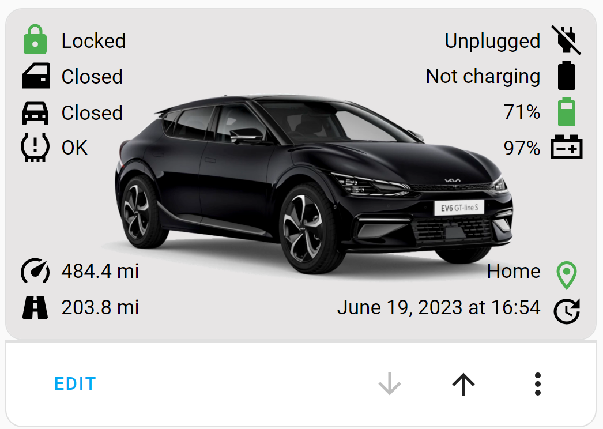

# Kia EV6 Dashboard
A graphical overview of data from the Kia Connect integration.

## How to use

 - Install/configure the [Kia Connect](https://github.com/Hyundai-Kia-Connect/kia_uvo) - this is out of scope for this repository. Refer to the [official repository](https://github.com/Hyundai-Kia-Connect/kia_uvo#installation) for full details.
 - Create an "images" folder in the /config/www folder of [Home Assistant](https://home-assistant.io). If the www folder doesn't exist, create it (along with the images folder) and restart Home Assistant.
 - Upload the [EV6.jpg](./EV6.jpg) file to the images directory.
 - Copy/paste the code from [kiaev6.yaml](./kiaev6.yaml) into a manual card (from a dashboard, click "Add Card" then scroll down to "Manual").

